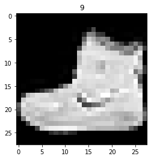

```python
!pip install keras-tuner
!pip install --upgrade tensorflow
```


```python
import tensorflow as tf
import keras_tuner
import matplotlib.pyplot as plt
import numpy as np
```


```python
import tensorflow as tf
tf.__version__
```


    '2.2.0'


```python
(x_train, y_train),(x_test, y_test) =tf.keras.datasets.fashion_mnist.load_data()
```


```python
x_train.shape
```


    (60000, 28, 28)


```python
set(y_train)
```


    {0, 1, 2, 3, 4, 5, 6, 7, 8, 9}


```python
plt.imshow(x_train[0], cmap="gray")
plt.title(y_train[0])
```


    Text(0.5, 1.0, '9')





#


```python
def create_model(hp):
    num_hidden_layers =1
    num_units=8
    dropout_rate=0.1
    learning_rate=0.01
    if hp:
        num_hidden_layers = hp.Choice('num_hidden_layers', values=(1,2,3))
        num_units = hp.Choice("num_units",values=(8,16,32))
        dropout_rate = hp.Float('dropout_rate', min_value=0.1, max_value=0.5)
        learning_rate = hp.Float('learning_rate',min_value=0.0001, max_value=0.01)
    model= tf.keras.Sequential()
    model.add(tf.keras.layers.Flatten(input_shape=(28,28)))
    model.add(tf.keras.layers.Lambda(lambda x:x/255.)) # une couche lambda pour normaliser les pixels
    for _ in range(0, num_hidden_layers):
        model.add(tf.keras.layers.Dense(num_units, activation='relu'))
        model.add(tf.keras.layers.Dropout(dropout_rate))
        model.add(tf.keras.layers.Dense(10, activation="softmax"))

    model.compile(loss="sparse_categorical_crossentropy",
               optimizer=tf.keras.optimizers.Adam(learning_rate=learning_rate),
               metrics=["accuracy"])
    return model
```

Maintenant que le model est construit on peu afficher son architecture en appliquant la méthode **summary**  


```python
create_model(None).summary()
```

    Model: "sequential_1"
    _________________________________________________________________
    Layer (type)                 Output Shape              Param #   
    =================================================================
    flatten_1 (Flatten)          (None, 784)               0         
    _________________________________________________________________
    lambda_1 (Lambda)            (None, 784)               0         
    _________________________________________________________________
    dense_2 (Dense)              (None, 8)                 6280      
    _________________________________________________________________
    dropout_1 (Dropout)          (None, 8)                 0         
    _________________________________________________________________
    dense_3 (Dense)              (None, 10)                90        
    =================================================================
    Total params: 6,370
    Trainable params: 6,370
    Non-trainable params: 0
    _________________________________________________________________


Ceci est notre model avec les paramètres par défaut
Créons maintenantant une classe quie hérite d'une classe du package **kerastuner**


```python
class CustomTuner(keras_tuner.tuners.BayesianOptimization):
    def run_trial(self, trial, *args, **kwargs):
        kwargs["batch_size"] = trial.hyperparameters.Int("batch_size", 32,128, step=32)
        super(CustomTuner, self).run_trial(trial,*args,**kwargs)
```


```python
tuner = CustomTuner(
    create_model,
    objective= "val_accuracy",
    max_trials=20,
    directory='logs',
    project_name="fashion_mnist",
    overwrite=True
)
```


```python
tuner.search_space_summary()
```

    Search space summary
    Default search space size: 4
    num_hidden_layers (Choice)
    {'default': 1, 'conditions': [], 'values': [1, 2, 3], 'ordered': True}
    num_units (Choice)
    {'default': 8, 'conditions': [], 'values': [8, 16, 32], 'ordered': True}
    dropout_rate (Float)
    {'default': 0.1, 'conditions': [], 'min_value': 0.1, 'max_value': 0.5, 'step': None, 'sampling': None}
    learning_rate (Float)
    {'default': 0.0001, 'conditions': [], 'min_value': 0.0001, 'max_value': 0.01, 'step': None, 'sampling': None}


```python
tuner.search(
   x_train, y_train ,
   validation_data=(x_test, y_test),
   epochs=5
)
```

    
    Search: Running Trial #1
    
    Hyperparameter    |Value             |Best Value So Far 
    num_hidden_layers |3                 |?                 
    num_units         |16                |?                 
    dropout_rate      |0.16266           |?                 
    learning_rate     |0.0079301         |?                 
    


    -------------------------------------------------------------------

    AttributeError                    Traceback (most recent call last)

    <ipython-input-30-5c4fdc73dd7e> in <module>
    ----> 1 tuner.search(
          2    x_train, y_train ,
          3    validation_data=(x_test, y_test),
          4    epochs=5
          5 )


    ~/anaconda3/lib/python3.8/site-packages/keras_tuner/engine/base_tuner.py in search(self, *fit_args, **fit_kwargs)
        142 
        143             self.on_trial_begin(trial)
    --> 144             self.run_trial(trial, *fit_args, **fit_kwargs)
        145             self.on_trial_end(trial)
        146         self.on_search_end()


    <ipython-input-27-bf820b434beb> in run_trial(self, trial, *args, **kwargs)
          2     def run_trial(self, trial, *args, **kwargs):
          3         kwargs["batch_size"] = trial.hyperparameters.Int("batch_size", 32,128, step=32)
    ----> 4         super(CustomTuner, self).run_trial(trial,*args,**kwargs)
    

    ~/anaconda3/lib/python3.8/site-packages/keras_tuner/engine/multi_execution_tuner.py in run_trial(self, trial, *fit_args, **fit_kwargs)
         69     def run_trial(self, trial, *fit_args, **fit_kwargs):
         70         model_checkpoint = keras.callbacks.ModelCheckpoint(
    ---> 71             filepath=self._get_checkpoint_fname(trial.trial_id, self._reported_step),
         72             monitor=self.oracle.objective.name,
         73             mode=self.oracle.objective.direction,


    ~/anaconda3/lib/python3.8/site-packages/keras_tuner/engine/tuner.py in _get_checkpoint_fname(self, trial_id, epoch)
        325         )
        326         if isinstance(
    --> 327             self.distribution_strategy, tf.distribute.TPUStrategy
        328         ) and not self.project_dir.startswith("gs://"):
        329             # TPU strategy only support saving h5 format on local path


    AttributeError: module 'tensorflow._api.v2.distribute' has no attribute 'TPUStrategy'


```python
model= tuner.get_best_models(num_models=1)[0]
```


```python
model.summary()
```


```python
_ = model.fit(
    x_train,y_train,
    validation_data=(x_test, y_test),
    epochs=20)
```
